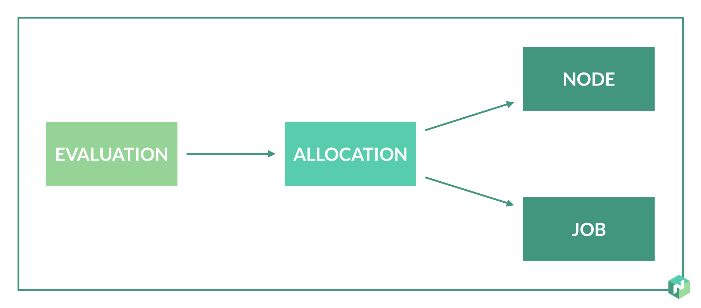

# Architecture
Clients talk to local server, one server is leader

https://nomadproject.io/docs/internals/architecture.html

!SUB
# Architecture

https://nomadproject.io/docs/internals/scheduling.html

!SUB
# Terminology
* Job, Task & Taskgroup
* Allocation & Evaluation
* Node, Agent, Server & Client
* Taskdriver
